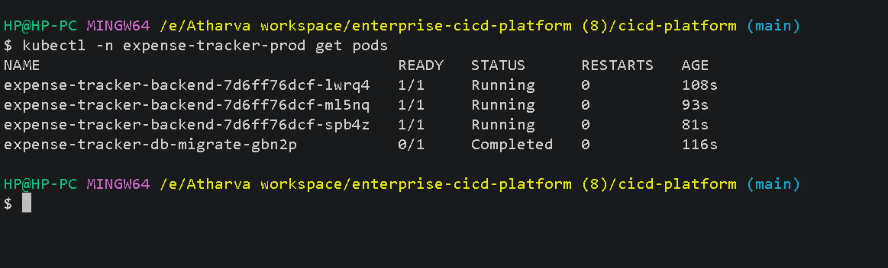
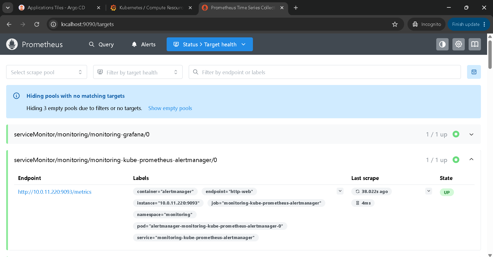
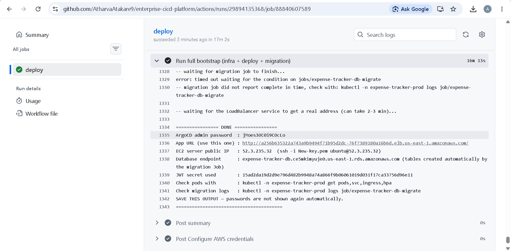
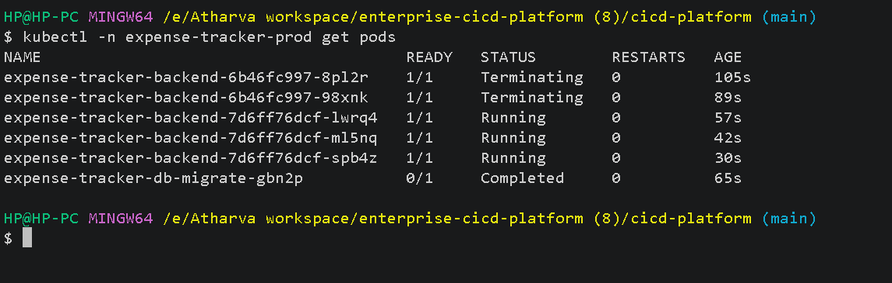
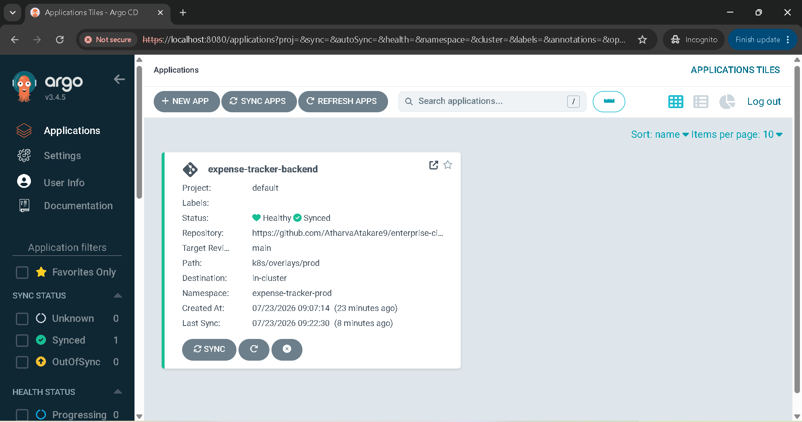
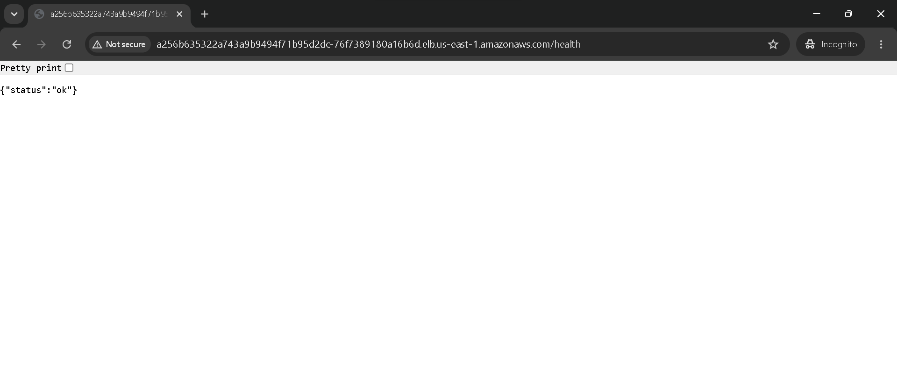
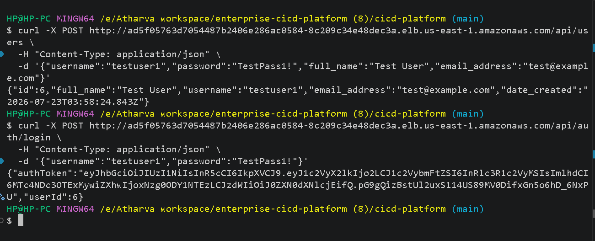
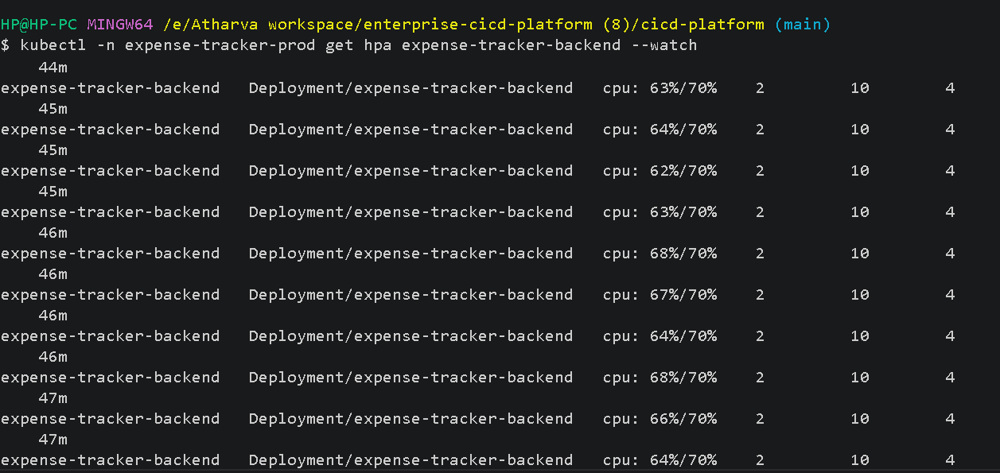
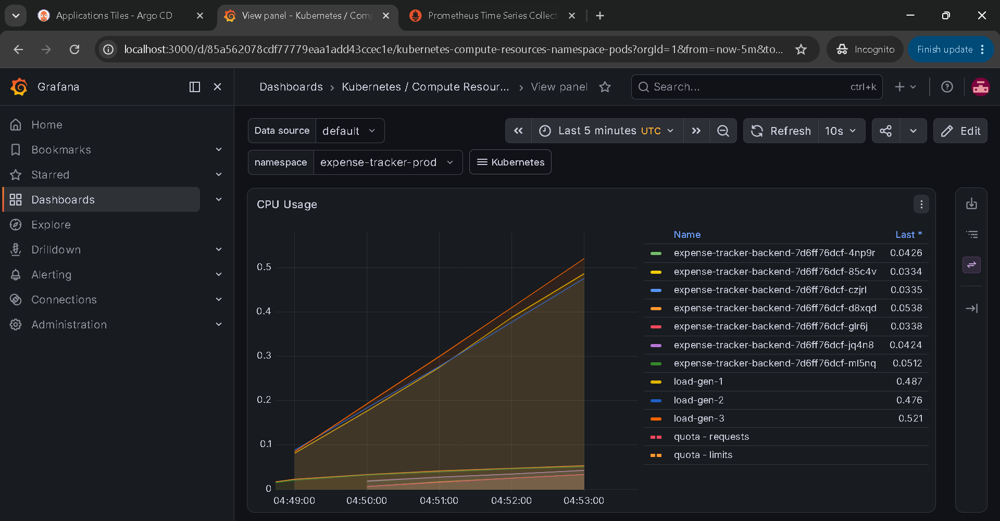

# Enterprise CI/CD Platform — Expense Tracker Backend

A complete, production-style GitOps pipeline: a Node.js/Express expense-tracking API,
containerized, deployed to AWS EKS, backed by RDS Postgres, auto-scaled, monitored, and
fully automated from `git push` to a live application — with zero manual infrastructure
clicking required.

This README documents the entire project end to end: architecture, installation,
day-to-day usage, monitoring, autoscaling, and a comprehensive troubleshooting section
built from real issues encountered and fixed during development.

---

## Table of contents

1. [Architecture](#architecture)
2. [Tech stack](#tech-stack)
3. [Repository structure](#repository-structure)
4. [Prerequisites](#prerequisites)
5. [Installation — from zero to a live app](#installation--from-zero-to-a-live-app)
6. [Post-deploy setup](#post-deploy-setup)
7. [Verifying the deployment](#verifying-the-deployment)
8. [API reference](#api-reference)
9. [GitOps workflow (ArgoCD)](#gitops-workflow-argocd)
10. [Autoscaling (HPA)](#autoscaling-hpa)
11. [Monitoring (Prometheus + Grafana)](#monitoring-prometheus--grafana)
12. [Tearing everything down](#tearing-everything-down)
13. [Troubleshooting](#troubleshooting)
14. [Cost awareness](#cost-awareness)
15. [Screenshots](#screenshots)
16. [Remaining / optional work](#remaining--optional-work)

---

## Architecture

```
Developer
   │  git push
   ▼
GitHub Repository
   │
   ├──▶ GitHub Actions (CI)      — lint, test, build Docker image, scan (Trivy), push to ECR
   │
   └──▶ GitHub Actions (Deploy)  — manually triggered, provisions/updates everything below
          │
          ▼
     Terraform  ──▶  AWS: VPC, EKS cluster, RDS Postgres, ECR, EC2 (optional), IAM
          │
          ▼
     Kubernetes (EKS)
          ├── ArgoCD              — watches this repo, auto-syncs k8s/overlays/prod
          ├── Deployment          — app pods (Node.js/Express), HPA-managed replica count
          ├── Migration Job       — runs Postgrator against RDS on every deploy
          ├── Service             — type LoadBalancer (native AWS NLB, no extra controller)
          └── Prometheus/Grafana  — cluster + app metrics, dashboards (optional install)
          │
          ▼
     Live App  ──▶  Internet-facing NLB  ──▶  EKS pods  ──▶  RDS Postgres (SSL)
```

**Why `Service: LoadBalancer` instead of an Ingress/ALB Controller?** The original design
used a Kubernetes `Ingress` with ALB Controller annotations, which requires installing the
AWS Load Balancer Controller separately. That controller was never installed, so the
Ingress sat inert and traffic never reached the pods. Switching to a native
`Service: type: LoadBalancer` works out of the box on EKS — no extra components needed —
and is what this project actually uses.

---

## Tech stack

| Layer | Tools |
|---|---|
| Cloud | AWS (EKS, RDS, ECR, EC2, VPC, IAM, NLB) |
| IaC | Terraform |
| CI/CD | GitHub Actions |
| Containers | Docker |
| Orchestration | Kubernetes (EKS) |
| GitOps | ArgoCD |
| App | Node.js, Express, Knex, PostgreSQL, Postgrator (migrations) |
| Autoscaling | Kubernetes HPA + metrics-server |
| Monitoring | Prometheus, Grafana (kube-prometheus-stack Helm chart) |
| Config management | Ansible (optional, skipped automatically outside Linux) |

---

## Repository structure

```
cicd-platform/
├── app/                        # Express API source
│   ├── src/
│   │   ├── app.js              # Express app, includes /health route
│   │   ├── server.js
│   │   ├── config.js
│   │   ├── auth/                # /api/auth — login
│   │   ├── users/                # /api/users — registration
│   │   └── expense/              # /api/expenses — CRUD
│   ├── migrations/              # Postgrator SQL migration files
│   ├── test/                    # Mocha/Supertest test suite
│   └── package.json
├── docker/
│   └── Dockerfile               # Multi-stage build; installs postgrator-cli explicitly
├── .github/workflows/
│   ├── ci.yml                   # Lint, test, build, scan, push to ECR
│   └── deploy.yml               # Full infra + app deploy (manual trigger)
├── terraform/
│   ├── modules/{vpc,ecr,eks,rds}/   # Reusable infra modules
│   └── envs/prod/                    # Root config, EC2 (optional), S3 backend
├── ansible/                     # Optional node bootstrap
├── k8s/
│   ├── base/                    # Deployment, Service (LoadBalancer), HPA, migration Job
│   └── overlays/{dev,prod}/     # Per-env image + replica patches
├── argocd/application.yaml      # ArgoCD Application — watches this repo
├── monitoring/                  # Reference Prometheus/Grafana config (Helm install used instead)
└── scripts/
    ├── config.env               # Non-secret config (region, cluster/bucket names)
    ├── bootstrap-all.sh         # ONE script: full infra + app + migration deploy
    ├── bootstrap-infra-only.sh  # Infra-only variant (for the server-based deploy path)
    ├── remote-deploy.sh         # Runs entirely on an EC2 server instead of your laptop
    └── deploy.sh                 # Manual single build+push+deploy helper
```

---

## Prerequisites

- An AWS account with billing enabled
- AWS access key + secret (IAM user with sufficient permissions — `AdministratorAccess`
  is simplest for getting started; tighten later for production use)
- A GitHub account, with this repository forked/cloned into your own account
- On your machine: Git, and either:
  - **Windows**: Git Bash (comes with [Git for Windows](https://git-scm.com/download/win))
  - **Mac/Linux**: any terminal
- Docker Desktop installed and running (needed if deploying from your own machine;
  not needed if deploying via GitHub Actions, since GitHub's runners already have Docker)

---

## Installation — from zero to a live app

There are two ways to run this. **GitHub Actions is strongly recommended** — it avoids
every local tool-installation headache (Docker, kustomize, etc.) since GitHub's runners
already have everything needed.

### Option A — Deploy via GitHub Actions (recommended)

**1. Push the full project to your GitHub repository** (not just the `app/` folder —
everything: `terraform/`, `k8s/`, `scripts/`, `.github/`, `docker/`):
```bash
git add .
git commit -m "initial commit"
git push origin main
```

**2. Create an AWS IAM role that GitHub can assume (one-time, in the AWS Console):**

- IAM → Identity providers → Add provider → OpenID Connect
  - Provider URL: `https://token.actions.githubusercontent.com`
  - Audience: `sts.amazonaws.com`
- IAM → Roles → Create role → Web identity → select the provider above →
  Audience `sts.amazonaws.com` → GitHub organization: your username → repository: your
  repo name
- Attach policy: `AdministratorAccess` (this pipeline provisions VPC/EKS/RDS/EC2/ECR/IAM,
  so it needs broad permissions; narrow this later for a production setup)
- Name the role (e.g. `github-actions-deploy-role`), create it, and **copy its ARN**
  from the top of the role's page — use the copy icon, not manual text selection, to
  avoid trailing whitespace issues.

**3. Set the trust policy correctly.** On the role → Trust relationships → Edit trust
policy:
```json
{
  "Version": "2012-10-17",
  "Statement": [
    {
      "Effect": "Allow",
      "Principal": {
        "Federated": "arn:aws:iam::<YOUR_ACCOUNT_ID>:oidc-provider/token.actions.githubusercontent.com"
      },
      "Action": "sts:AssumeRoleWithWebIdentity",
      "Condition": {
        "StringEquals": {
          "token.actions.githubusercontent.com:aud": "sts.amazonaws.com"
        },
        "StringLike": {
          "token.actions.githubusercontent.com:sub": "repo:<YOUR_GITHUB_USERNAME>/<YOUR_REPO_NAME>:*"
        }
      }
    }
  ]
}
```
> **Note:** if your AWS account uses the newer "pinned identity" OIDC verification
> method, the `sub` value must include numeric GitHub IDs, e.g.
> `repo:username@123456/reponame@789012:*`. Check the exact required format via
> AWS CloudTrail (Event history → filter by event name `AssumeRoleWithWebIdentity`) if
> you hit an `AccessDenied` error — the `userIdentity.principalId` field in the failed
> event shows the exact string AWS expected.

**4. Add the GitHub repository secret:**
Repo → Settings → Secrets and variables → Actions → New repository secret
- Name: `AWS_ROLE_ARN`
- Value: the full ARN from step 2 (paste carefully — no extra quotes, no trailing
  newline, no `AWS_ROLE_ARN=` prefix accidentally included)

**5. Trigger the deployment:**
Repo → Actions tab → **"Deploy Infrastructure & App"** (left sidebar) →
**"Run workflow"** → confirm on `main`.

**6. Wait 20–30 minutes.** Click into the running workflow → the "Run full bootstrap"
step → watch the log. It ends with a summary block:
```
================ DONE ================
ArgoCD admin password  : ...
App URL (use this one) : http://...elb.us-east-1.amazonaws.com/
EC2 server public IP   : ...
Database endpoint      : ...
JWT secret used         : ...
========================================
```
**Copy this entire block somewhere safe** — it is not shown again automatically.

### Option B — Deploy from your own machine

Only needs `terraform` and `aws` CLI installed locally (both usually already present
on a dev machine); the script auto-installs `kubectl`/`kustomize`/`ansible` where
possible, and clearly tells you what to `winget install` on Windows if Docker itself is
missing.

```bash
aws configure   # one-time — paste your access key, secret key, and region (us-east-1)
chmod +x scripts/bootstrap-all.sh
./scripts/bootstrap-all.sh
```

---

## Post-deploy setup

These are one-time steps needed **after each fresh cluster creation** (i.e. after a
`terraform destroy` + redeploy cycle) — they are automated for the identity that *runs*
the deploy script (GitHub Actions' role, or your own CLI session if using Option B), but
if you want `kubectl` access from a **different** machine/identity than the one that
deployed, you need to grant it explicitly:

```bash
aws eks create-access-entry --cluster-name expense-tracker-eks --region us-east-1 \
  --principal-arn <YOUR_IAM_USER_ARN> --type STANDARD

aws eks associate-access-policy --cluster-name expense-tracker-eks --region us-east-1 \
  --principal-arn <YOUR_IAM_USER_ARN> --access-scope type=cluster \
  --policy-arn arn:aws:eks::aws:cluster-access-policy/AmazonEKSClusterAdminPolicy

aws eks update-kubeconfig --name expense-tracker-eks --region us-east-1
```
Find your own ARN with: `aws sts get-caller-identity --query Arn --output text`

> The security-group fix for NodePort traffic and the cluster-access grant for the
> *deploying* identity are both automated inside `scripts/bootstrap-all.sh` as of the
> latest version — you should not need to do this manually unless accessing from a
> second machine/identity.

---

## Verifying the deployment

```bash
# Pods healthy?
kubectl -n expense-tracker-prod get pods
# Expect: app pods 1/1 Running, migration job 0/1 Completed

# Migration succeeded?
kubectl -n expense-tracker-prod logs job/expense-tracker-db-migrate

# App reachable?
kubectl -n expense-tracker-prod get svc expense-tracker-backend
curl http://<EXTERNAL-IP-from-above>/health
# Expect: {"status":"ok"}

# ArgoCD in sync?
kubectl -n argocd get applications
# Expect: SYNC STATUS Synced, HEALTH STATUS Healthy
```

---

## API reference

| Method | Path | Body | Notes |
|---|---|---|---|
| POST | `/api/users` | `username, password, full_name, email_address` | Password: 8–25 chars, must include upper+lower+number+special char |
| POST | `/api/auth/login` | `username, password` | Returns `authToken` (JWT) + `userId` |
| GET | `/api/users` | — | Lists all users |
| GET | `/api/expenses` | — | Lists expenses (requires auth header) |
| POST | `/api/expenses` | expense fields | Requires auth header |
| DELETE | `/api/expenses/:id` | — | Returns `204 No Content` on success |
| GET | `/health` | — | Returns `{"status":"ok"}` — used by all health checks |

**Verified working example:**
```bash
curl -X POST http://<app-url>/api/users \
  -H "Content-Type: application/json" \
  -d '{"username":"testuser1","password":"TestPass1!","full_name":"Test User","email_address":"test@example.com"}'

curl -X POST http://<app-url>/api/auth/login \
  -H "Content-Type: application/json" \
  -d '{"username":"testuser1","password":"TestPass1!"}'
```

**Inspecting the database directly** (it's in a private subnet, so query it from inside
the cluster, not your laptop):
```bash
cd terraform/envs/prod
DB_ENDPOINT=$(terraform output -raw db_endpoint)
DB_PASS=$(terraform output -raw db_password)
cd ../../..
kubectl run psql-client --rm -it --restart=Never --image=postgres:16-alpine \
  -n expense-tracker-prod -- psql "postgresql://postgres:${DB_PASS}@${DB_ENDPOINT}:5432/expense_tracker?sslmode=require"
```
Then: `SELECT * FROM users;`

---

## GitOps workflow (ArgoCD)

ArgoCD continuously watches `k8s/overlays/prod` in this repository. Any change committed
and pushed to `main` under that path is automatically detected and applied to the
cluster — **no manual `kubectl apply` needed** for routine changes.

**Access the ArgoCD UI:**
```bash
kubectl -n argocd port-forward svc/argocd-server 8080:443
```
Visit `https://localhost:8080` (accept the self-signed certificate warning). Login:
`admin` / the ArgoCD password from your deploy output block.

**Important — HPA vs. GitOps conflict.** Since the Deployment's replica count is
dynamically managed by the HPA, ArgoCD is configured to *ignore* differences in
`spec.replicas` (see `argocd/application.yaml`'s `ignoreDifferences` block). Without
this, ArgoCD's `selfHeal` would fight the HPA, repeatedly resetting the replica count
back to whatever is hardcoded in git — this was a real bug found and fixed during
development.

**Testing auto-sync yourself:**
```bash
# Make any small change under k8s/base or k8s/overlays, e.g.:
git add .
git commit -m "test change"
git push origin main
# Wait 1-3 minutes, then check — no kubectl apply needed:
kubectl -n expense-tracker-prod get pods
```

---

## Autoscaling (HPA)

The Deployment is configured to scale 2–10 replicas, targeting 70% CPU utilization
(`k8s/base/hpa.yaml`). EKS does not include `metrics-server` by default — install it
once per cluster:

```bash
kubectl apply -f https://github.com/kubernetes-sigs/metrics-server/releases/latest/download/components.yaml
kubectl -n kube-system rollout status deployment/metrics-server --timeout=120s
kubectl top pods -n expense-tracker-prod   # confirm real metrics are flowing
```

**Load-testing it (verified working — confirmed scaling 2→6 replicas under load):**
```bash
# On Windows Git Bash, prefix with MSYS_NO_PATHCONV=1 to avoid path-mangling issues
MSYS_NO_PATHCONV=1 kubectl run load-gen-1 --image=curlimages/curl -n expense-tracker-prod \
  --restart=Never -- /bin/sh -c "while true; do curl -s -o /dev/null http://expense-tracker-backend.expense-tracker-prod.svc.cluster.local/health; done"
# Repeat for load-gen-2, load-gen-3 for a stronger signal

kubectl -n expense-tracker-prod get hpa expense-tracker-backend --watch
# Watch TARGETS climb past 70%, then REPLICAS increase

# Clean up afterward:
kubectl delete pod load-gen-1 load-gen-2 load-gen-3 -n expense-tracker-prod --force --grace-period=0 --ignore-not-found=true
```

---

## Monitoring (Prometheus + Grafana)

Not installed by default — install via Helm when needed:

```bash
# Install Helm if you don't have it (Windows):
curl -L -o helm.zip https://get.helm.sh/helm-v3.15.0-windows-amd64.zip
unzip helm.zip && mv windows-amd64/helm.exe /usr/bin/helm.exe

helm repo add prometheus-community https://prometheus-community.github.io/helm-charts
helm repo update

helm install monitoring prometheus-community/kube-prometheus-stack \
  --namespace monitoring --create-namespace \
  --set grafana.adminPassword=Admin123!

kubectl get pods -n monitoring   # wait for everything to be Running
```

**Accessing Grafana:**
```bash
kubectl port-forward -n monitoring svc/monitoring-grafana 3000:80
```
Visit `http://localhost:3000` → login `admin` / `Admin123!` → **Dashboards** (left
sidebar) → **"Kubernetes / Compute Resources / Namespace (Pods)"** → set the
**namespace** dropdown at the top to `expense-tracker-prod` → live CPU/memory graphs
for your app appear.

**Accessing Prometheus directly (optional):**
```bash
kubectl port-forward -n monitoring svc/monitoring-kube-prometheus-prometheus 9090:9090
```
Visit `http://localhost:9090` → **Status → Targets** to confirm your app is being
scraped.

---

## Tearing everything down

```bash
cd terraform/envs/prod
terraform init -reconfigure -backend-config="bucket=expense-tracker-tfstate-<YOUR_ACCOUNT_ID>"
terraform destroy -var="key_pair_name=New-key" -auto-approve
```

**Common blockers and fixes** (see also the Troubleshooting section):
- **ECR "repository not empty"** — delete images first, or force-delete the repo:
  ```bash
  aws ecr delete-repository --repository-name expense-tracker-backend --region us-east-1 --force
  ```
- **RDS subnet group "still in use"** — the DB instance itself must be deleted first:
  ```bash
  aws rds delete-db-instance --db-instance-identifier expense-tracker-db --region us-east-1 --skip-final-snapshot
  # wait several minutes for it to fully disappear, then retry destroy
  ```

**Confirm everything's actually gone:**
```bash
aws eks list-clusters --region us-east-1
aws rds describe-db-instances --region us-east-1
aws ec2 describe-instances --region us-east-1 --filters "Name=tag:Project,Values=expense-tracker" --query "Reservations[].Instances[].State.Name"
```
All should be empty/terminated.

---

## Troubleshooting

A comprehensive list of real issues encountered and fixed during development — check
here first if something breaks, since most failure modes have already been solved once.

### Terraform / infrastructure

| Symptom | Cause | Fix |
|---|---|---|
| `BucketAlreadyExists` on state bucket creation | S3 bucket names are globally unique across *all* AWS accounts, not just yours | Bucket name auto-appends your AWS account ID (`scripts/bootstrap-all.sh` does this automatically) |
| `unsupported Kubernetes version 1.29` | AWS deprecates old EKS versions over time; omitting the version does **not** default to "latest" — it silently falls back to an old, sometimes-unsupported version | Pin an explicit current version in `terraform/modules/eks/main.tf` (`version = "1.32"`); bump this number if AWS deprecates it again |
| `EntityAlreadyExists` / `ResourceInUseException` on re-apply | Leftover resources from a previous, partially-failed `destroy` | Manually clean up via AWS Console (IAM roles, EKS cluster, RDS instance/subnet group, ECR repo, VPC) before retrying, working through dependencies in this order: DB instance → DB subnet group → EKS node group → EKS cluster → NAT Gateway → Elastic IP → Internet Gateway → Subnets → Route Tables → Security Groups → VPC |
| `InvalidSubnet.Conflict: CIDR conflicts` | A leftover VPC from a partial destroy still occupies the CIDR range | Fully clean up the old VPC (see above) before the next apply |
| `Saved plan is stale` | Two processes touched Terraform state concurrently (e.g. a manual destroy running while CI also touched state) | Harmless — just re-run plan+apply once nothing else is running against the state |

### Database (RDS)

| Symptom | Cause | Fix |
|---|---|---|
| `Error: self-signed certificate in certificate chain` | Newer `pg`/`pg-connection-string` versions strictly validate SSL certs by default; AWS RDS uses Amazon's own CA, not in Node's default trust store | Use `?uselibpqcompat=true&sslmode=require` in `DATABASE_URL` (not just `sslmode=require` alone) |
| `no pg_hba.conf entry ... no encryption` | RDS requires SSL, but the connection string didn't request it | Add `sslmode=require` to `DATABASE_URL` |
| `postgrator: not found` in migration job | `postgrator-cli` is a devDependency; `npm ci --only=production` in the Dockerfile skips it, but the migration Job needs it at runtime | Dockerfile explicitly runs `RUN npm install postgrator-cli@^4.0.0 --no-save` after the production install |

### Kubernetes

| Symptom | Cause | Fix |
|---|---|---|
| App pods stuck `CrashLoopBackOff`, readiness/liveness probe `404` | App has no `/` route; health checks were pointed at `/` | Add a real `/health` route to `app/src/app.js`, point Docker `HEALTHCHECK` and k8s probes at `/health` instead of `/` |
| `503 Service Temporarily Unavailable` from load balancer, target group has zero registered targets | The original `Ingress` setup required the AWS Load Balancer Controller, which was never installed — nothing was registering pods to the ALB's target group | Switched `k8s/base/service.yaml` to `type: LoadBalancer` (native EKS support, no extra controller needed); removed the non-functional `Ingress` |
| `curl: Failed to connect` even though pods and LB both look healthy | EKS's auto-created cluster security group blocks inbound NodePort traffic (30000-32767) by default | Automated in `bootstrap-all.sh`: `aws ec2 authorize-security-group-ingress ... --port 30000-32767 --cidr 0.0.0.0/0` |
| `kubectl: You must be logged in to the server` | A fresh EKS cluster only grants API access to the identity that created it; your personal AWS identity is different from whichever ran the deploy (e.g. GitHub Actions' role) | One-time per identity: `aws eks create-access-entry` + `aws eks associate-access-policy` (see Post-deploy setup) |
| `The cluster's authentication mode must be set to ... API_AND_CONFIG_MAP` | Cluster defaults to the older auth mode, which doesn't support access entries | `aws eks update-cluster-config --access-config authenticationMode=API_AND_CONFIG_MAP`, wait for `ACTIVE`, then retry the access-entry commands |
| `Job ... field is immutable`, or Job stuck `Terminating` forever | Kubernetes Jobs cannot be updated in place; a stuck delete is usually a finalizer holding it | Force-delete pods with the job label, strip the Job's finalizers via patch, then force-delete the Job itself — all automated now in the deploy scripts before every reapply |
| `InvalidImageName` on the migration Job | The image tag `kustomization.yaml` referenced in **git** (e.g. a placeholder like `latest`) didn't match what was actually pushed to ECR (a commit-hash tag) — the deploy script updated the tag *locally* but never committed that change back to git, so ArgoCD (which syncs from git) kept re-creating resources with the stale/wrong tag | The deploy script now commits and pushes its real image tag back to git after every build, keeping git and the cluster's actual state in sync |
| ArgoCD `SYNC STATUS: Unknown`, `unable to resolve 'main' to a commit SHA` | `argocd/application.yaml`'s `repoURL` still pointed at the original placeholder scaffold repo, not your actual fork | Update `repoURL` to your real GitHub repo URL |
| Replica count oscillating (2→3→2→3...) with no load applied | ArgoCD's `selfHeal` was fighting the HPA — ArgoCD kept resetting `replicas` to the value hardcoded in git, while HPA tried to manage it dynamically | Add `ignoreDifferences` for `/spec/replicas` on the Deployment in `argocd/application.yaml` |

### CI/CD pipeline

| Symptom | Cause | Fix |
|---|---|---|
| `Error: Could not assume role with OIDC: Not authorized ...` despite a correct-looking trust policy | AWS's newer "pinned identity" OIDC verification appends numeric GitHub user/repo IDs to the `sub` claim (e.g. `repo:user@123/repo@456:*`), which a plain `repo:user/repo:*` trust policy won't match | Check the exact expected format via CloudTrail (`AssumeRoleWithWebIdentity` failed events → `userIdentity.principalId`) and update the trust policy's `sub` condition to match exactly |
| `Error: Could not assume role with OIDC: Request ARN is invalid` | The `AWS_ROLE_ARN` GitHub secret has extra characters — quotes, whitespace, or a wrong prefix, usually from a copy-paste error | Delete and recreate the secret, pasting only the raw ARN with no surrounding text |
| `Github rate-limiter failed the request` during kustomize install | The install script queries GitHub's API for the latest release, which is easy to rate-limit on shared CI runners | Download a specific, pinned kustomize version directly by URL instead of using the API-dependent install script |
| CI test `DELETE /api/expenses/:id` fails, `expected 200 got 204` | Test was asserting the wrong status code — `204 No Content` is the correct REST response for a successful DELETE with no body | Fixed the test assertion to `.expect(204)` |
| `ci.yml`'s image-tag-bump commit step silently does nothing | The `sed` pattern searched for `image: ...`, but `kustomization.yaml` actually uses `newName:`/`newTag:` keys — the pattern never matched | Corrected the `sed` pattern to target `newTag: .*` |

### Local environment (Windows / Git Bash)

| Symptom | Cause | Fix |
|---|---|---|
| `git show origin/main:path/to/file` → `fatal: ambiguous argument ... unknown revision` | Git Bash (MSYS) auto-converts what it thinks are Windows paths, mangling the `:` in git refs | Prefix the command with `MSYS_NO_PATHCONV=1` |
| `curl: URL rejected: Malformed input` when running commands with URLs inside `kubectl run ...` | Same MSYS path-mangling issue, corrupting URL strings before they reach the container | Prefix with `MSYS_NO_PATHCONV=1` |
| A file edit "doesn't take" even after committing and pushing | The file was never actually saved to disk before `git add` (common with GUI editors, or multi-line `sed`/heredoc commands that don't behave as expected in Git Bash) | Always verify the actual file content on disk (`grep` for the expected change) *before* staging/committing — don't trust that an edit "looks right" in an editor tab |
| `git push` rejected: `fetch first`, or a large-file error (`GH001`) | Local and remote branches diverged (e.g. edits made both on GitHub's web UI and locally without pulling in between); or Terraform's `.terraform/` provider binaries got accidentally committed | `git pull` and resolve conflicts by rewriting the file's known-correct content directly (safest: overwrite the whole file via heredoc rather than manually editing conflict markers); add a `.gitignore` for `**/.terraform/`, `*.tfstate*`, `*.pem` |
| Ansible fails/unavailable | Ansible needs a real Linux shell; Git Bash on Windows can't run it | The deploy script detects this and skips Ansible automatically — it's optional and not required for the app to function (the app runs on managed EKS nodes, not plain EC2 servers) |

---

## Cost awareness

This project provisions real, billable AWS resources — most notably an EKS cluster
(control plane + worker nodes), an RDS instance, and a load balancer, none of which are
free. **Always run `terraform destroy` when you're done testing** (see
"Tearing everything down") to avoid ongoing charges. Also check for and delete the
Terraform state S3 bucket if you're fully done with the project:
```bash
aws s3 rb s3://expense-tracker-tfstate-<YOUR_ACCOUNT_ID> --force
```

---

## Screenshots

## 📸 Project Screenshots

| # | Screenshot | What it proves |
|---|---|---|
| 1 |  | Real infrastructure exists and is healthy |
| 2 |  | CI pipeline completed successfully |
| 3 |  | CD pipeline deployed the application successfully |
| 4 |  | Pods, Service and HPA are running |
| 5 |  | GitOps synchronization with ArgoCD |
| 6 |  | Application health endpoint is responding |
| 7 |  | User registration and authentication work |
| 8 |  | Data is successfully stored in PostgreSQL |
| 9 |  | Horizontal Pod Autoscaler scales the application |
| 10 |  | Grafana monitoring dashboard with application metrics |
---
